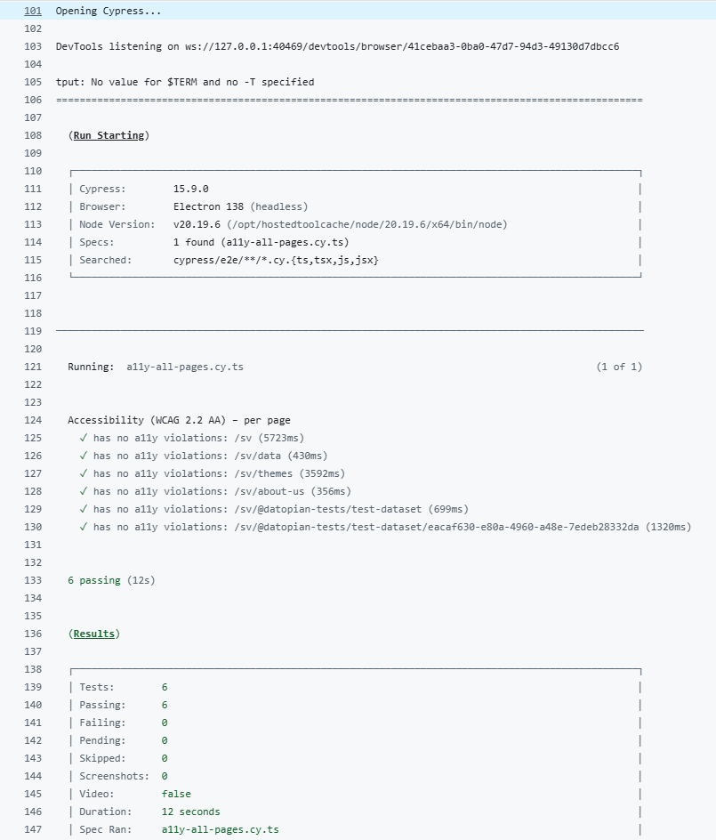

# Accessibility Checks (developer guide)

This project includes automated accessibility checks using Cypress + Axe.

The goal is to:

- catch common accessibility issues early
- fail PRs when regressions are introduced

## What runs automatically

On every pull request and push:

- routes are generated automatically
- Cypress opens each route
- Axe scans the page using WCAG 2.2 AA rules
- the build fails if any violation is found

## How routes are generated

Routes are generated by:

```bash
scripts/generate-routes.mjs
```

This script creates:

```bash
public/__routes.json
```

### Static routes

The script:

- scans the Next.js App Router (`src/app` or `app`)
- looks for `page.tsx`, `page.jsx`, or `page.js`

Example output:

```text
/
/groups
/search
/organizations
```

## CKAN dataset routes (dynamic pages)

To also scan dataset pages, the script fetches one dataset from CKAN.

Using:

- `NEXT_PUBLIC_DMS` (CKAN base URL)
- `package_search` API

It adds:

- `/@org-name/dataset-name`
- `/@org-name/dataset-name/resource-id` (first resource only)

This ensures:

- dataset pages are covered
- resource pages are covered
- tests stay fast and deterministic

## How accessibility tests work

Tests live in:

```bash
cypress/e2e/a11y-all-pages.cy.ts
```

For each generated route:

- Cypress visits the page
- Axe is injected
- WCAG rules are executed:
- `wcag2aa`
- `wcag21aa`
- `wcag22aa`

If a violation is found:

- the test fails
- detailed logs are printed:
- rule ID (for example `color-contrast`)
- impact level
- CSS selectors
- HTML snippets

## Example failure output

You may see errors like:

- `color-contrast`
- `aria-required-attr`
- `label`

This usually points to:

- low contrast text
- missing labels
- invalid ARIA usage

The console output shows exact selectors so the issue can be fixed quickly.

## Running locally

Run everything:

```bash
npm run test:e2e
```

Generate routes only:

```bash
npm run routes:gen
```

## Environment variables

| Variable | Purpose |
| --- | --- |
| `NEXT_PUBLIC_DMS` | CKAN base URL |

## CI behavior

In CI:

- tests run automatically on PRs
- test status is visible in GitHub
- PRs cannot be merged if accessibility checks fail

## Report example



## Lighthouse report


## Summary

- routes are generated automatically
- dataset and resource pages are included
- WCAG 2.2 AA rules are enforced
- checks fail fast on PRs

## References

- Cypress documentation: https://docs.cypress.io/
- cypress-axe: https://github.com/component-driven/cypress-axe
- axe-core: https://github.com/dequelabs/axe-core
- WCAG 2.2 (W3C): https://www.w3.org/TR/WCAG22/
