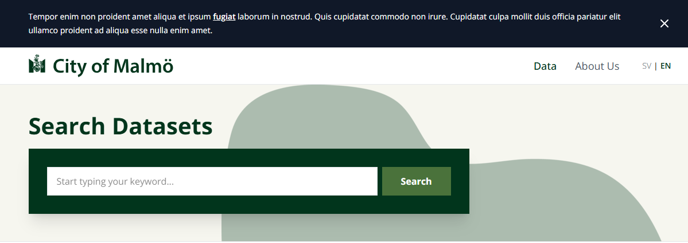

# Disclaimer banner

Adding a dismissable banner on top of all pages, with translatable markdown content.

### How to manage the content

To **enable** the disclaimer banner:

* Navigate to `/content/banner` in your repository
* Add the [English](../../content/banner/en.md) content to `en.md`
* Add the [Swedish](../../content/banner/sv.md) content to `sv.md`
* Add the [Danish](../../content/banner/da.md) content to `da.md`
* Commit the change through the normal review process. Deployment behavior is
  not configured in this repository, so confirm which branch targets each
  environment before publishing.

Note that markdown is supported.

To **disable** the banner, simply clear the contents of the files.

**Screenshot:**

