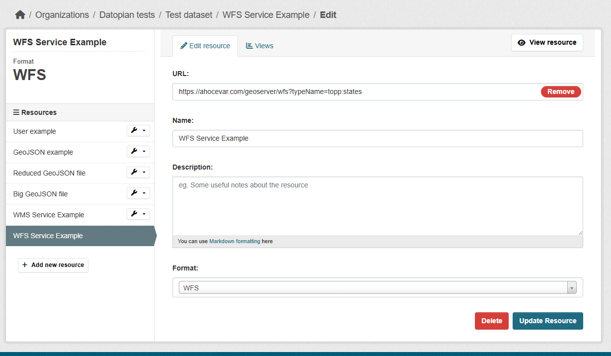

## WMS/WFS Resource Upload Guide

This portal renders OGC previews when a resource format is `WMS` or `WFS`.

Relevant code:
- `src/components/package/resource/ResourcePreview.tsx`
- `src/components/package/resource/OgcServiceMapPreview.tsx`

## In CKAN: how to create the resource

1. Open the dataset in CKAN and click **Add new resource**.
2. Set **Format** to `WMS` (map tiles/services) or `WFS` (feature services).
3. In **URL**, paste a service URL that includes the target layer name in query params.
4. Save the resource.

## URL requirements

The preview reads the layer name from these URL params:
- `layers` (used for WMS, also accepted generally)
- `typeName` or `typeNames` (used for WFS)

Parameter names are handled case-insensitively by the frontend.

If the layer parameter is missing:
- WMS shows: `WMS preview requires a layers parameter in the resource URL.`
- WFS shows: `WFS preview requires a typeName or typeNames parameter in the resource URL.`

## Valid examples

WFS example:

```text
https://ahocevar.com/geoserver/wfs?typeName=topp:states
```

WMS example:

```text
https://nowcoast.noaa.gov/geoserver/ows?layers=ndfd_temperature:air_temperature
```

Also valid WFS example with `typeNames`:

```text
https://example.com/geoserver/ows?service=WFS&typeNames=workspace:layer
```

## How rendering works (important for publishers)

### WMS

- The map creates a Leaflet WMS layer from the resource base URL + query params.
- `layers` must identify a real published layer.
- On map click, the frontend requests `GetFeatureInfo` and tries to show feature attributes in a popup.
- If tiles fail, users see a service/layer error.

### WFS

- The frontend requests `GetFeature` with `outputFormat=application/json`, default `version=2.0.0` (if not provided), and `typeNames=<layer>`.
- It paginates requests (`count=1000`, up to 5000 features total).
- The service must return valid GeoJSON `FeatureCollection`.


## Practical checklist before publishing

- Confirm **Format** is exactly `WMS` or `WFS`.
- Confirm URL opens publicly (no login required).
- Confirm URL includes one of: `layers`, `typeName`, `typeNames`.
- Confirm the layer name is correct (`workspace:layer` when required by server).
- Prefer HTTPS URLs.
- Verify CORS allows browser requests from this portal (otherwise preview cannot load).



## Notes

- The preview also shows a generated **GetCapabilities URL** based on your service URL.
- `bbox` in the resource URL is optional; if provided, the map will initially fit to it.

